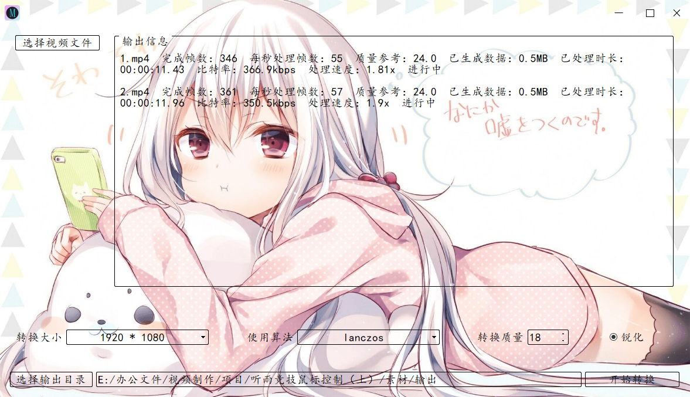

Media Tools
===========

开发环境：

- Python 3.10.16

- VS Code

打包工具：

- PyInstaller

## 简介

- 这是一个视频缩放工具，主要用来解决缩放分辨率倍率不为整数时出现的大幅模糊问题
- 当然，用来当做简单的视频缩放工具也很方便

## 使用方法

- 下载或克隆项目到本地

```
    git clone https://github.com/yuerfive/Media-Tools.git
```

- 安装依赖

```
    pip install -r requirements.txt
```

- 下载 ffmpeg 并配置为环境变量或解压到项目根目录

```
    https://www.gyan.dev/ffmpeg/builds/ffmpeg-release-full.7z
```

- videotools.py 中检查 ffmpeg 代码

```python
    # 检查是否存在 ffmpeg 程序
    self.ffmpeg = r'ffmpeg\bin\ffmpeg.exe'
    if not os.path.exists(r'ffmpeg\bin\ffmpeg.exe'):
        self.ffmpeg = 'ffmpeg'
```

- 运行程序

```
    python main.py
```

## 界面展示


